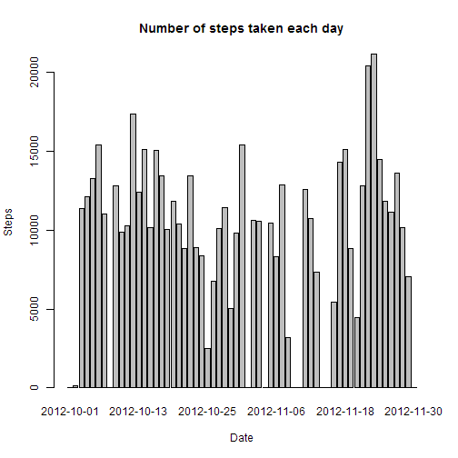
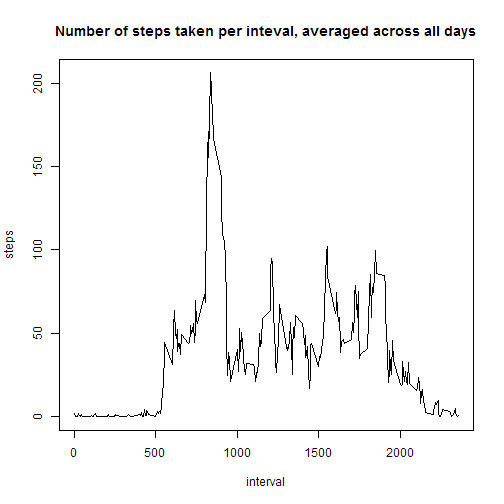
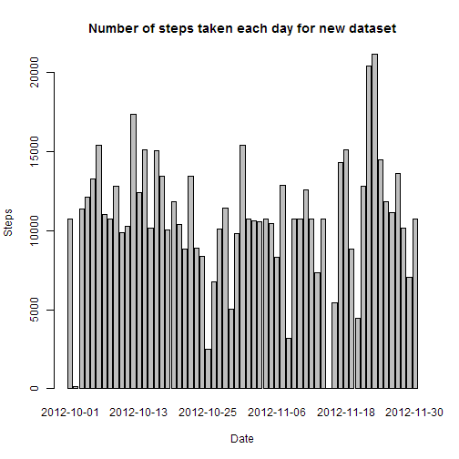
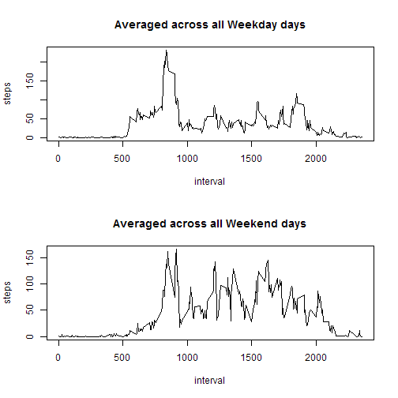

# Reproducible Research: Peer Assessment 1


## Loading and preprocessing the data


```r
unzip("activity.zip")
activity <- read.csv("activity.csv")
```

## What is mean total number of steps taken per day?

### Histogram of the total number of steps taken each day

```r
stepspds <- aggregate(steps ~ date, data = activity, FUN = sum, na.rm = TRUE, 
    na.action = na.pass)
barplot(stepspds$steps, main = "Number of steps taken each day", xlab = "Date", 
    ylab = "Steps", names.arg = stepspds$date)
```

 

_Please note that there is several day with zero steps values._

### Mean and median total number of steps taken per day
_Days with no values for steps was also included in this calculation as days with zero steps values._

```r
mn <- as.integer(mean(stepspds$steps))
md <- as.integer(median(stepspds$steps))
```

The __mean__ of the total number of steps taken per day is __9354__ and the __median__ is __10395__.

## What is the average daily activity pattern?

```r
stepspim <- aggregate(steps ~ interval, data = activity, FUN = mean, na.rm = TRUE, 
    na.action = na.pass)
plot(stepspim, type = "l", main = "Number of steps taken per inteval, averaged across all days")
```

 


__Which 5-minute interval, on average across all the days in the dataset, contains the maximum number of steps?__

```r
maxint <- stepspim$interval[which.max(stepspim$steps)]
```

The __835__ interval contains the maximum number of steps on average across all the days in the dataset.

## Imputing missing values

### The total number of missing values in the dataset 

```r
nassum <- sum(is.na(activity))
```

The total number of missing values in the dataset is __2304__. 

### My strategy for filling in all of the missing values in the dataset

I decided to use the means for the 5-minute intervals (averaged across all days) to  fill the missing values.

### New dataset with the missing data filled in

```r
activityf <- merge(activity, stepspim, by = "interval", suffixes = c("", ".y"))
isnas <- is.na(activityf$steps)
activityf$steps[isnas] <- activityf$steps.y[isnas]
activityf$steps.y = NULL  ##drop column
```


### Histogram of the total number of steps taken each day for new dataset 

```r
stepspdsf <- aggregate(steps ~ date, data = activityf, FUN = sum)
bp <- barplot(stepspdsf$steps, main = "Number of steps taken each day for new dataset", 
    xlab = "Date", ylab = "Steps", names.arg = stepspdsf$date)
```

 


### Mean and median total number of steps taken per day for new dataset

```r
mnf <- as.integer(mean(stepspdsf$steps))
mdf <- as.integer(median(stepspdsf$steps))
```

The __mean__ of the total number of steps taken per day for new dataset is __10766__ and the __median__ is __10766__.

These values are really differ from the estimates for initial data set: __9354__ and the __10395__.

The new values are bigger since there is now no days with zero values which bias the initial estimation of mean and median. Such calculation seems more correct.

## Are there differences in activity patterns between weekdays and weekends?
I have created a new factor variable in the dataset with two levels – “weekday” and “weekend” indicating whether a given date is a weekday or weekend day.

```r
activityf$weekdaytype <- factor(weekdays(as.Date(activityf$date)) %in% c("Saturday", 
    "Sunday"), levels = c("FALSE", "TRUE"), labels = c("weekday", "weekend"))
```


Below is the panel plot containing a time series plot of the 5-minute interval (x-axis) and the average number of steps taken, averaged across all weekday days and weekend days (y-axis).

```r
par(mfrow = c(2, 1))

## weekdays
stepsptmwd <- aggregate(steps ~ interval, data = activityf, subset = activityf$weekdaytype == 
    "weekday", FUN = mean)
plot(stepsptmwd, type = "l", main = "Averaged across all Weekday days")

## weekends
stepsptmwd <- aggregate(steps ~ interval, data = activityf, subset = activityf$weekdaytype == 
    "weekend", FUN = mean)
plot(stepsptmwd, type = "l", main = "Averaged across all Weekend days")
```

 

From this figure is clearly seen that there is some differences in activity patterns between weekdays and weekends.
